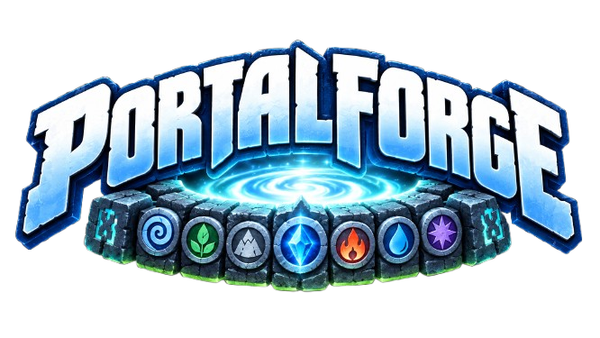
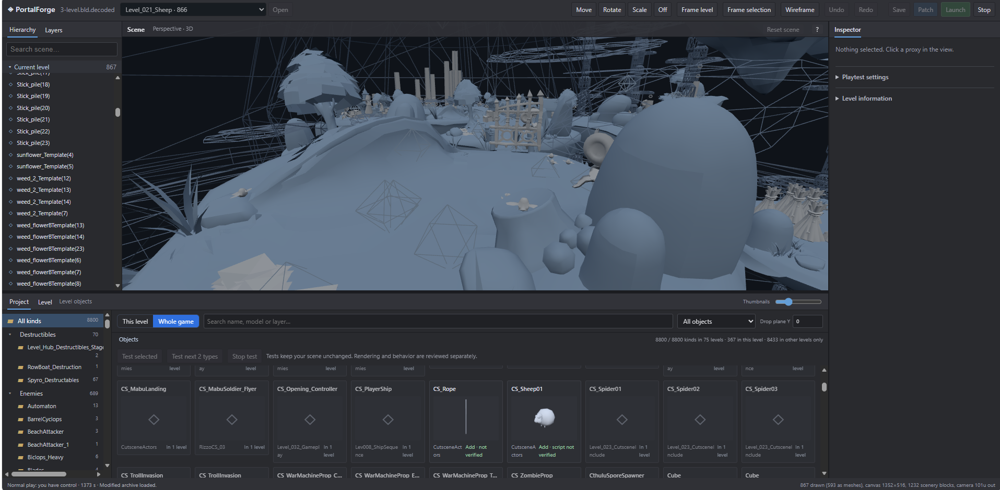
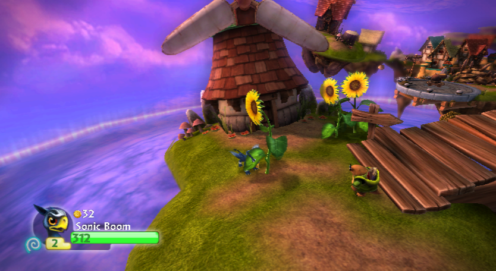
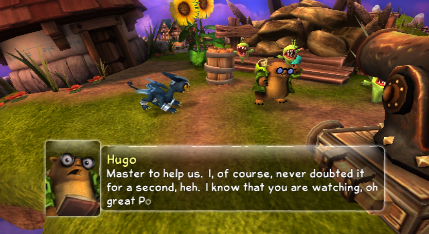
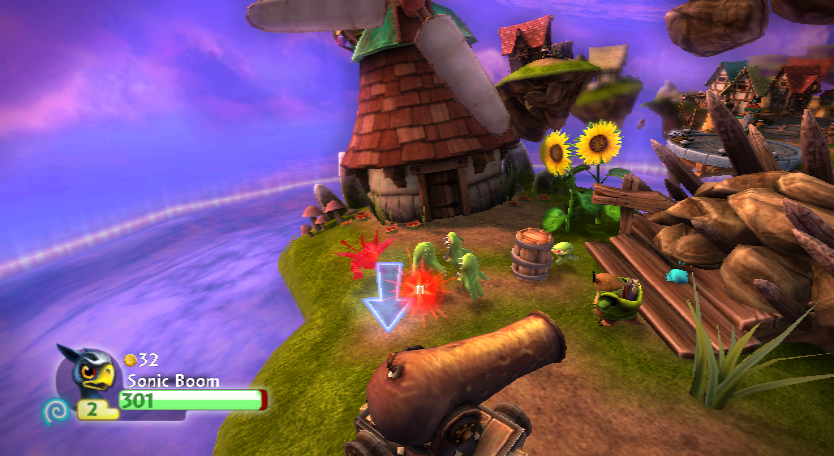
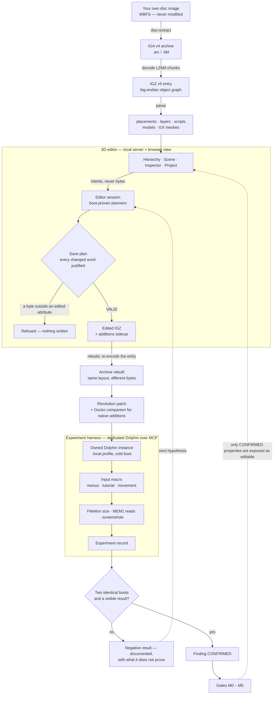

<div align="center">
  
  <h1>PortalForge</h1>
  <p><b>A 3D level editor and reverse-engineering toolkit for <i>Skylanders: Spyro's Adventure</i> (Wii)</b></p>
</div>

<p align="center">
  <a href="https://github.com/DEX-zha/PortalForge/actions/workflows/ci.yml"></a>
  
  
  
  
  
  
  
  
</p>

<p align="center">
  <a href="#what-is-portalforge">What is it</a> ·
  <a href="#the-editor">Editor</a> ·
  <a href="#evidence-not-vibes">Evidence</a> ·
  <a href="#what-works-today">What works</a> ·
  <a href="#getting-started">Getting started</a> ·
  <a href="#documentation">Docs</a> ·
  <a href="#how-the-project-is-developed">Development</a> ·
  <a href="#license-and-credit">License</a>
</p>

---

## What is PortalForge?

PortalForge turns a 2011 Wii game's level files into something you can open, look at in 3D, edit, and boot —
without ever touching the original disc image.

It is three things in one repository:

- **A format toolkit** — readers, writers and diffing for the game's `IGA v4` archives and the `IGZ v5` object
  graphs inside them, including the LZMA chunking, the placement records, the scripts and the GX mesh geometry.
- **A 3D editor** — a local server plus a browser view (Three.js, no bundler) that opens any of the game's 76
  levels with its real geometry and placements, lets you move, rotate, duplicate and **add** objects, and compiles
  the result back into a Riivolution patch.
- **An experiment harness** — a dedicated Dolphin instance driven over MCP, with input macros, memory reads,
  screenshots and machine-checked experiment records, so that every claim about the game can be reproduced.

Nothing here modifies your disc image: edits are shipped as replacement files loaded next to the original
through Riivolution, exactly the way the retail game reads them.

## The editor



A Unity-like workspace: **Hierarchy** and layers on the left, the **Scene** in the middle with the level's real
decoded meshes and Move/Rotate/Scale gizmos, the **Inspector** on the right (position, model, behaviour script,
layers, shared state, evidence and safety flags), and the **Project** browser at the bottom with categories and
3D thumbnails generated from the level's own geometry. The **Level** tab next to it lists the 76 levels of the
disc, each with its state and what the editor is allowed to do there; the header picker opens any of them.

Each card in Project carries its verdict rather than a guess: **Add** for a source with a confirmed native
recipe, **Needs test** for one that is structurally eligible but never booted, **Related source tested** when a
sibling of the same family was the one actually proven. The counters read the same way — 673 objects,
9 that can be added, 234 testable families, and the addition budget used out of 8.

The view shows the level as the game stores it: placed objects in the default layers, stored templates and
disabled objects (the ones a script clones or activates later) in a hidden layer of their own. While the level
plays in the launcher's Dolphin, **As in game** reads the running scene from memory and draws what the game
created at run time — the cannon on a moved push block, the fan blades, a key — over the stored placements.

The toolbar chain is the whole workflow: **Save → Patch → Launch**. Launch owns its own Dolphin, runs the
tutorial macro, captures every step and closes cleanly — or drops you straight into the chosen level to play
it yourself.

## Evidence, not vibes

Every capability in this repository has to survive the same rule: **two identical cold boots, a proven file
consumption, and a visual result** — a boot that merely succeeds proves nothing, and neither does a memory write.

| A duplicated prop, in game | Eight native additions, in game | The additions during play |
|---|---|---|
|  |  |  |
| A third sunflower copied over a weed slot, with the original pair untouched (`editor-test-1789503985200`, 2/2 boots) | A barrel, coins and Chompy Nippers created natively next to Hugo — nothing was sacrificed to make room (`editor-direct-play-1789592930696`) | The same additions keep their scripts and activation ranges: they move, fight and can be destroyed |

Each of those runs has a machine-readable record under `.local/dolphin-evidence/experiments/`, a finding in
[`docs/findings/`](docs/findings/) carrying its confidence level (CONFIRMED / LIKELY / UNKNOWN), and a written
scope stating what the run does **not** prove.

## What works today

| Capability | State | Where it is proven |
|---|---|---|
| Read, verify, rebuild and diff `IGA v4` archives (`.arc` / `.bld`, LZMA) | **CONFIRMED** | [`docs/format/iga-v4.md`](docs/format/iga-v4.md), gate M1 |
| Change one value in a level and see the predicted in-game effect | **CONFIRMED** | gate M2 |
| Duplicate a record by same-size replacement (never by insertion) | **CONFIRMED** | gate M3, [`docs/format/igz-level-editing.md`](docs/format/igz-level-editing.md) |
| Move / rotate / re-place props from the 3D editor | **CONFIRMED** | [`specs/003-placement-editor-3d/`](specs/003-placement-editor-3d/) |
| Decode the level's GX mesh geometry and draw the real scenery | **LIKELY**, read-only | [`docs/format/igz-mesh-geometry.md`](docs/format/igz-mesh-geometry.md) |
| Translate a scripted prop together with its private trajectory | **CONFIRMED** | [`docs/editor/scripted-movement.md`](docs/editor/scripted-movement.md) |
| **Add** up to eight extra objects with no victim, from nine exact sources | **CONFIRMED** (tutorial, SSPP52 Rev1) | [`specs/005-native-object-addition/validation.md`](specs/005-native-object-addition/validation.md) |
| Boot straight into the edited tutorial, skipping the menus | **CONFIRMED** (tutorial only) | [`docs/editor/direct-entry.md`](docs/editor/direct-entry.md) |
| Open any of the 76 levels by name and move its objects | **CONFIRMED** (tutorial and Mining, two identical boots each); LIKELY on the levels not booted with an edit yet | [`specs/006-multi-level-editing/`](specs/006-multi-level-editing/) |
| Boot straight into the chosen level from Patch (the level served under the tutorial's file names) | **CONFIRMED** (Mining, two identical boots); LIKELY for the other levels | [`docs/level-entry-status.json`](docs/level-entry-status.json) |
| Tell stored templates and disabled objects from placed ones, on every level | **LIKELY** (read in the running game on Mining) | [`docs/findings/`](docs/findings/) `igz.placement.inactive-flag` |
| Draw the scene as the game runs it: states, actors and the objects scripts create | **LIKELY**, read-only (Mining, one run) | [`docs/findings/`](docs/findings/) `level.runtime.scene-snapshot` |
| Any object of any level, as many times as wanted; objects from other levels | **UNKNOWN** — specified, gates M4A / M5 | [`specs/007-unlimited-additions/`](specs/007-unlimited-additions/) |
| New geometry, new collision, gameplay scripting | **UNKNOWN** — gates M4B / M5 | [`docs/editor/roadmap.md`](docs/editor/roadmap.md) |

`node tools/ssa-archive/cli.mjs gates` prints the current state of every gate with its evidence.

## How it works



Two things in that loop carry the project.

The **save plan** is the safety rail: it is built *before* the write, checked word by word against the bytes that
are about to be written, and any byte outside an edited attribute makes the whole save refuse rather than degrade.

The **findings loop** is what keeps the editor honest: a run does not unlock a feature, a confirmed finding does.
Until two identical boots agree, a capability stays a diagnostic — visible, explained, and refused.

## Getting started

**Prerequisites** — Windows, Node.js 24, your own legitimate copy of the game as a WBFS image, and the Dolphin
research profile described in [`docs/mcp/dolphin-mcp.md`](docs/mcp/dolphin-mcp.md). No game data ships with this
repository, and none ever will.

```powershell
# 1. install (two independent packages, no bundler)
cd tools/dolphin-mcp   ; npm ci --ignore-scripts ; npm test
cd ../ssa-archive      ; npm ci --ignore-scripts ; npm test

# 2. point the toolkit at your own image
#    .local/dolphin-config.json  ->  { "game": "D:/path/to/SSA.wbfs" }
node cli.mjs identify --game "D:/path/to/SSA.wbfs"

# 3. open the 3D editor on a level; extraction and decoding happen on first use, under .local/
node cli.mjs edit levels
node cli.mjs edit open Level_027_Tutorial --port 7400 --open

# or serve one decoded file explicitly (no level picker in that mode)
node cli.mjs disc-extract --game "D:/path/to/SSA.wbfs" --path level/Level_027_Tutorial.bld --out .local/samples
node cli.mjs extract .local/samples/DATA/files/level/Level_027_Tutorial.bld --out .local/workspaces/tutorial-bld --decode
node cli.mjs edit serve .local/workspaces/tutorial-bld/entries/3-level.bld.decoded \
  --archive level/Level_027_Tutorial.bld --entry 3 --port 7400 --open
```

The header of the editor lists every level of the disc; **Open** switches to another one, and the Level
information panel says what the editor can do there and on which evidence.

Then edit in the browser and press **Save → Patch → Launch**. The launcher owns its own Dolphin instance in
`.local/dolphin-user/`; your personal Dolphin installation is never driven, and the WBFS is never written to.

> The editor server must be started from a terminal that is allowed to create processes. A server started inside
> a restricted sandbox fails at launch time with `spawn EPERM` — see
> [`docs/editor/dolphin-workflow.md`](docs/editor/dolphin-workflow.md).

## Repository layout

```
tools/ssa-archive/     the toolkit: CLI, IGA/IGZ readers and writers, editor server, 3D view, tests
tools/dolphin-mcp/     the Dolphin MCP server, Python bridge and native UI helpers
specs/                 spec-kit features: spec, plan, research, data model, contracts, tasks, validation
docs/format/           file-format documentation (IGA v4, IGZ level editing, mesh geometry)
docs/editor/           editor workflow, direct entry, scripted movement, scene poses, roadmap
docs/mcp/              the Dolphin MCP dossier and the M0 gate
docs/findings/         every finding, with confidence, evidence and editable scope
docs/experiments/      how an experiment is run and judged
docs/reports/          generated corpus reports
docs/*-status.json     gate state, read by the tooling (`cli.mjs gates`)
.local/                everything game-derived: profiles, patches, dumps, captures — never committed
```

## Documentation

- **Start here** — [`docs/README.md`](docs/README.md) indexes every document.
- **Formats** — [IGA v4 containers](docs/format/iga-v4.md) · [IGZ level editing](docs/format/igz-level-editing.md) · [mesh geometry](docs/format/igz-mesh-geometry.md)
- **Editor** — [roadmap](docs/editor/roadmap.md) · [patch, launch and scripted movement](docs/editor/dolphin-workflow.md) · [direct level entry](docs/editor/direct-entry.md) · [scene poses](docs/editor/scene-poses.md) · [missing-scenery study](docs/editor/missing-scenery-study.md)
- **Runtime** — [Dolphin MCP, gate M0](docs/mcp/dolphin-mcp.md) · [how experiments are judged](docs/experiments/README.md)
- **Findings** — [index](docs/findings/) with one JSON record per claim, rendered to Markdown by `cli.mjs findings render`
- **Specs** — [001 level research](specs/001-ssa-level-research/) · [002 entity model](specs/002-igz-entity-model/) · [003 3D editor](specs/003-placement-editor-3d/) · [004 object workflow](specs/004-object-workflow/) · [005 native addition](specs/005-native-object-addition/) · [006 multi-level editing](specs/006-multi-level-editing/) · [007 unlimited additions](specs/007-unlimited-additions/)

## How the project is developed

**Spec first.** Every feature starts as a spec-kit folder under `specs/`: specification, plan, research, data
model, contracts, tasks, then a validation report written after the runs — not before. Tasks carry a real state;
a documented batch is never reported as a delivered one.

**Gates before capabilities.** M0 (runtime), M1 (archive round-trip), M2 (controlled mutation) and M3 (entity
duplication) are PASS; M4A (new assets), M4B (collision) and M5 (gameplay) are UNKNOWN, and no tool is allowed
to pretend otherwise. A property is only made editable once its finding is CONFIRMED.

**Tests and reproduction.** 337 tests in `tools/ssa-archive`, 6 in `tools/dolphin-mcp`, plus scripted WebGL
browser runs (catalogue, and the level switch across three levels) and the two-boot Dolphin protocol. Failures and negative results are documented as carefully as the
successes — the research files are full of them, because they are what makes the successes trustworthy.

**One standard for the code.** Prettier and ESLint run over both tools from the repository root
(`npm run format`, `npm run lint`) and in CI, so style is never a review topic and an unused import or a
duplicated option key fails the build. Every module opens with what it is for, machine-specific paths live in
`.local/dolphin-config.json` rather than in the source, and a refactor of boot-proven code is checked against
recorded outputs of the real level before it lands.

**AI in the loop, including local models.** PortalForge is built with coding agents (Codex CLI and Claude Code)
and with **local inference running on two NVIDIA DGX Spark units**. Keeping a local tier matters here for a
practical reason: the material this project reasons over is game-derived — memory dumps, decoded archives and
in-game captures — and it stays on the researcher's own hardware. The agents write code, documentation and
experiment plans; the gates, the two-boot rule and the tests are what decide whether any of it is true.

**A human drives the reverse engineering.** The agents are fast at writing code and at grinding through dumps,
and consistently wrong about what a byte *means* until someone checks. The reverse-engineering and decoding
reasoning — what a record actually is, which pointer is real, why a level froze rather than loaded — is human
work, and so is the debugging: watching the Dolphin window, spotting that an "invisible" object was never the
one being moved, rejecting an agent's plausible-but-wrong logic and correcting it before it becomes a finding.
Several results in `docs/findings/` exist only because that review said "no, boot it again and look" — the two
identical boots are the rule precisely because a machine's confidence is not evidence.

## Scope, and what this project is not

PortalForge is an **amateur, non-commercial reverse-engineering project for research and preservation**. It is
not affiliated with Activision, Toys for Bob, Vicarious Visions or Nintendo; *Skylanders*, *Spyro's Adventure*,
*Portal of Power* and the related names belong to their respective owners.

The repository contains **no game data**: no disc image, no archive, no texture, no sound, no save and no figure
dump. All work happens on the copy the researcher legally owns, through replacement files loaded beside the
original image, never by modifying it. The few in-game screenshots published above are illustrative evidence for
documented experiments; the bulk of the captures, dumps and reports stays in the untracked `.local/` folder.

What is published here is a description of file formats and experimental methods, each with its confidence
level, so that other people can reproduce the experiments on their own copy.

## License and credit

Reuse is welcome — **with credit**. The repository is licensed in two halves:

| What | License | What it asks of you |
|---|---|---|
| Code — `tools/`, and any snippet in the docs | [Apache-2.0](LICENSE) | Keep the copyright notice, this [`NOTICE`](NOTICE) file and the license text with any redistribution, and state prominently which files you changed. |
| Documentation, specs, findings and reports — `README.md`, `docs/`, `specs/` | [CC BY 4.0](LICENSE-DOCS) | Credit PortalForge, link to the license, and say if you changed anything — for copies, translations and adaptations alike. |

Suggested credit line:

> Based on **PortalForge** — https://github.com/DEX-zha/PortalForge
> Code: Apache-2.0 · Documentation and findings: CC BY 4.0

This covers the reverse-engineering work as it is written here: the format descriptions, the record layouts and
offsets, the editing recipes, the experiment protocols and the evidence tables. Two honest notes about that.
First, copyright protects the way those results are expressed, not a technique or a measured fact once you have
re-derived or re-expressed it yourself — no license can change that, and this one does not pretend to. Second,
that is exactly why the request matters: every offset in `docs/` cost boots, frozen levels and negative results
that are documented alongside the successes. If your editor, tool, wiki page or video stands on this work, name
it and link back, so the next person can find the evidence behind the claim rather than the claim alone.

Game data is out of scope of both licenses: nothing here grants any right over *Skylanders: Spyro's Adventure*,
its archives, its assets or its trademarks.
